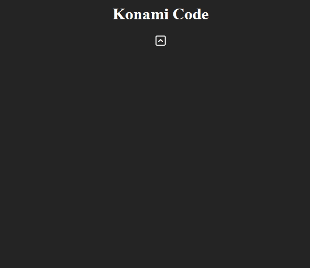

# Konami Code 

This was a challege provided by a recruiter. 



## Installation

1. Clone the repository<br>
```js
git clone https://github.com/AndresAltv/Dots-challenge.git
```

2. Install dependencies<br>
```js
npm install
```


3. Start server<br>
```js
npm run dev
```
